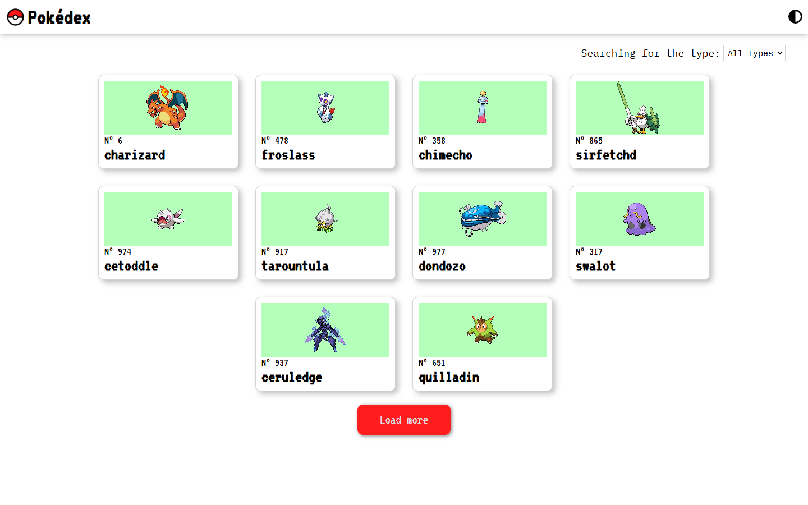
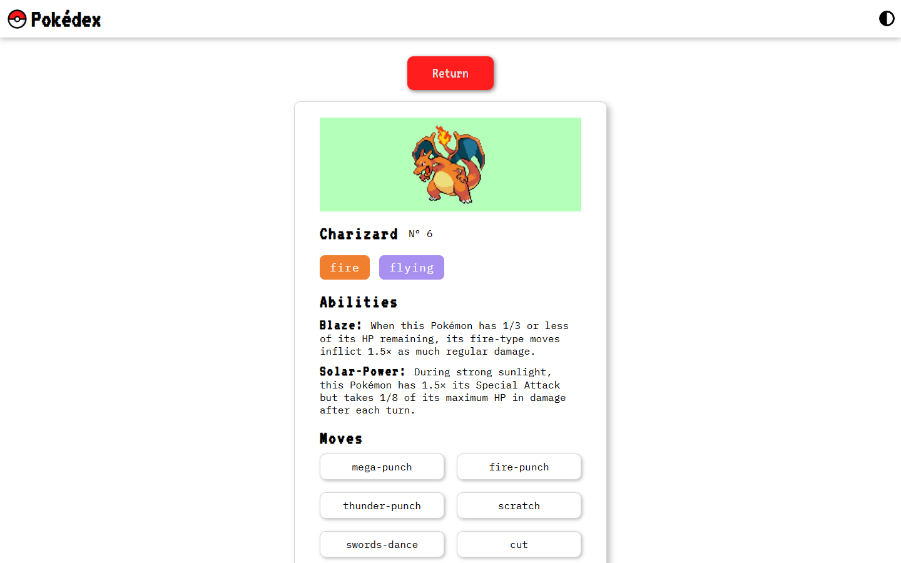
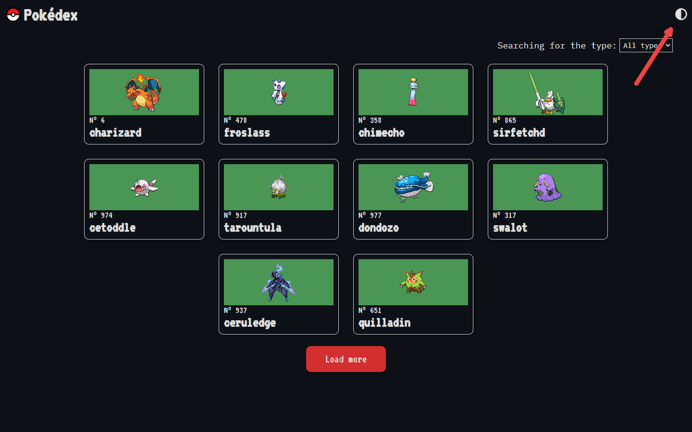

# Pokédex
Este projeto tem o intuito de fornecer aos fãs de Pokémon informações sobre essas fascinantes criaturas de forma simples e intuitiva. 
A aplicação fornecerá, de forma aleatória, dez Pokémon. Caso algum chame sua atenção, você poderá selecioná-lo para descobrir mais informações sobre ele.
### Home  

### Informações sobre o pokemon

Caso não esteja satisfeito com a seleção inicial, basta clicar no botão "Load more" para carregar mais dez Pokémon.
## Modo escuro
Você também pode alternar o esquema de cores da página com o botão no cabeçalho, caso sua visão esteja cansada.

## Processo de criação
Como eu não tinha um layout modelo específico para me basear, comecei pensando em como seria o design da interface. Para isso, usei como inspiração tanto o design da interface dos jogos de Pokémon do Game Boy quanto os cards colecionáveis de Pokémon (que me inspiraram a colocar as informações em containers em forma de carta). Para reforçar essa estética de jogo antigo, quis utilizar fontes pixelizadas (fonte: VT323) para os textos. Porém, isso prejudicou a legibilidade dos textos mais longos, tornando-os difíceis de ler. Por isso, utilizei a fonte pixelizada apenas para destacar títulos e escolhi uma fonte mais legível, mas que ainda remetesse à estética de um jogo, para os textos mais longos (fonte: IBM Plex Mono). 
O filtro de tipos é um input <i>select</i> que lista todos os tipos de Pokémon para o usuário filtrar. Uma vez escolhido, o tipo do Pokémon é passado para a função responsável pela busca e criação da lista, onde cada Pokémon é verificado para identificar se seu tipo corresponde ao selecionado no filtro. Se for correspondente, ele é adicionado à lista; caso contrário, ele é descartado, e o processo se repete até que a lista possua dez itens. 
Os cards possuem uma animação que faz seu tamanho aumentar, criando a ilusão de que a carta está "saltando" assim que o mouse paira sobre ela, mostrando que aquele elemento é interativo. Já os botões "Load more" e "Return" recebem uma sombra interna quando o mouse passa por cima, simulando um botão afundando ao ser pressionado. 
Para o botão de alternar tema, eu precisava de um componente que fosse constante em todas as páginas, permitindo que o usuário alterasse o tema tanto na página inicial quanto na página de detalhes. Por isso, implementei uma "barra de navegação" que não fosse afetada pelo React Router, sendo assim constante em todas as rotas.
 
A estrutura de arquivos foi pensada para isolar cada funcionalidade e facilitar a localização dos arquivos.
- ### Components  
   Possui subpastas que correspondem aos componentes. Cada pasta possui dois arquivos: o arquivo index, responsável por montar o componente, e um arquivo com os estilos do componente.
- ## Contexts
  Esta pasta abriga os arquivos com as declarações de contexto da Context API do React. No momento, contém apenas o contexto de temas da aplicação.
- ## Pages 
  Responsável por configurar e gerenciar o React Router. Contém os arquivos de página, que abrigam os componentes a serem renderizados de acordo com a URL. Também contém o arquivo que define o BrowserRouter e as rotas da aplicação.
- ## Services
  Contém os arquivos responsáveis por realizar as requisições para a API.

## Tecnologias utilizadas
 - <b>Vite + React</b>: O Vite oferece um ambiente de desenvolvimento mais rápido e prático em relação ao <i>Create React App</i>.
 - <b>React Router</b>:  Essencial para construir <i>Single Page Applications</i> de forma eficiente.
 - <b>Context API</b>: Possibilita a criação e funcionamento do sistema de alteração do esquema de cores da página inteira.
 - <b>Styled Components</b>: Facilita o processo de estilização dinâmica de componentes com base em <i>props</i> e remove automaticamente estilos não utilizados, ajudando na performance geral.
 - <b>PokeApi</b>: Responsável por fornecer os dados sobre todos os Pokémon.
 - <b>FontAwesome</b>: Biblioteca de ícones que fornece o ícone do botão de alternar tema. Escolhi esta biblioteca porque seus ícones são tratados como fontes, oferecendo uma vasta gama de opções de estilização.

 ## Como usar?
 1. Abra o prompt de comando
 2. Digite o código `git clone https://github.com/VictorEsPe/Pokedex`
 3. Vá para o diretório do projeto com o comando `cd Pokedex`
 4. Use o comando `npm install` para instalar todas as dependências do projeto
 5. Digite o código `npm run dev` para rodar o projeto