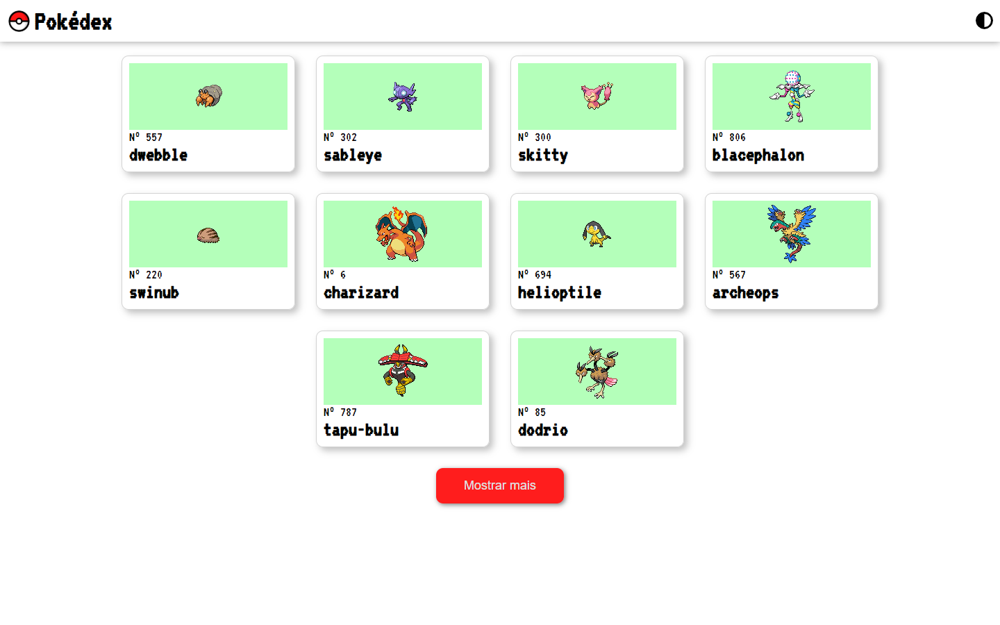
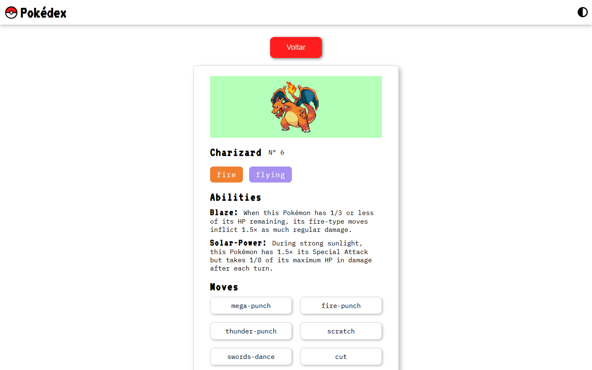
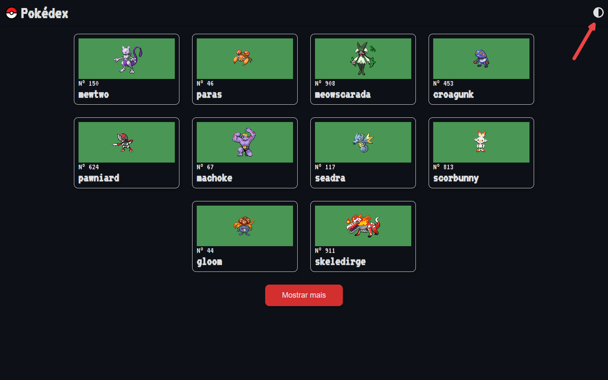

# Pokédex
Este projeto tem o intuito de fornecer aos fãs de pokemons informações sobre as fascinantes criaturas de forma simples e intuitiva. 
A aplicação fornecerá de forma aleatória dez pokemons, caso algum chame sua atenção, você poderá selecioná-lo para descobrir mais informações sobre ele.

### Home  

### Informações sobre o pokemon

Caso não esteja satisfeito com a seleção inicial, basta clicar no botão "Mostrar mais" para carregar mais dez pokemons. Você também pode alternar o esquema de cores da página com o botão no cabeçalho caso sua visão esteja cansada.
## Modo escuro 

## Processo de criação
Como eu não tinha um layout modelo específico para me basear, comecei pensando em como seria o design da interface. Para isso, usei de inspiração tanto o design da interface dos jogos de pokemon do GameBoy quanto cards colecionáveis de pokemons (que me inspiraram a colocar as informações em containers em forma de carta). Para reforçar essa estética de jogo antigo, quis utilizar fontes pixelizadas (fonte: VT323) para os textos. Porém, isso prejudicou a legibilidade dos textos mais longos, tornando-os difíceis de se ler. Por isso utilizei a fonte pixelizada para dar destaque apenas em títulos e uma fonte que seja mais fácil de se ler mas que ainda lembre a estética de um jogo em textos mais longos (fonte: IBM Plex Mono). 
Os cards possuem uma animação que faz seu tamanho aumentar, criando uma ilusão da carta estar "saltanto" assim que o mouse paira sobre ela, mostrando que aquele elemento é interativo. Já os botões de "Mostrar mais" e "Voltar" recebem uma sombra interna quando o mouse passa por cima, simulando um botão afundando ao ser pressionado. 
Para o botão de alternar tema, eu precisava de um componente que fosse constante em todas as páginas para que o usuário pudesse alterá-lo tanto na página inicial quanto na página de detalhes. Por isso isso implementei uma "barra de navegação" que não fosse afetada pelo React Router, sendo assim constante em todas as rotas. 
A estrutura de arquivos foi pensada para isolar cada funcionalidade e facilitar a localização dos arquivos.
- ### Components  
  Possui subpastas que correspondem aos componentes, cada pasta possui dois arquivos: o arquivo index responsável por montar o componente, e um arquivo com os estilos do componente.
- ## Contexts
  Esta pasta deve abrigar os arquivos com as declarações de contexto da context API do React, no caso, contém apenas o contexto de temas da aplicação.
- ## Pages 
  Responsável por configurar e gerenciar o React Router. Contém os arquivos de página que abrigam os componentes que deverão ser renderizados de acordo com a URL. Contém também o arquivo que determina o BrowserRouter e as rotas URL que serão usadas. 
- ## Services
  Contém os arquivos responsáveis por realizar as requisições para a API.

## Tecnologias utilizadas
 - <b>Vite + React</b>: o vite oferece um ambiente de desenvolvimento mais rápido e prático em relação ao <i>Create React App</i>
 - <b>React Router</b>: essencial para construir <i>Single Page Applications</i> de forma eficiente
 - <b>Context API</b>: possibilita a criação e funcionamento do sistema de alteração do esquema de cores da página inteira
 - <b>Styled Components</b>: facilita o processo de estilizar componentes de forma dinâmica com base em <i>props</i> e remove automaticamente estilos que não estão sendo utilizados, ajudando na performance geral;
 - <b>PokeApi</b>: responsável por fornecer os dados sobre todos os pokemons
 - <b>FontAwesome</b>: biblioteca de ícones que fornece o ícone do botão de alternar tema. Escolhi esta biblioteca pois seus ícones são tratados como fontes, dando uma vasta gama de opções de estilização para os ícones

 ## Como usar?
 1. Abra o prompt de comando
 2. Digite o código `git clone https://github.com/VictorEsPe/Pokedex`
 3. Vá para o diretório do projeto com o comando `cd Pokedex`
 4. Use o comando `npm install` para instalar todas as dependências do projeto
 5. Digite o código `npm run dev` para rodar o projeto